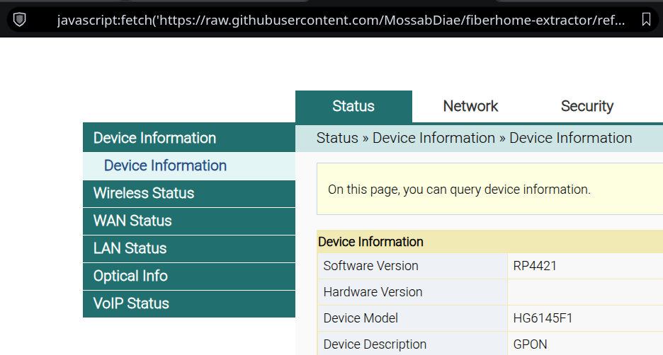
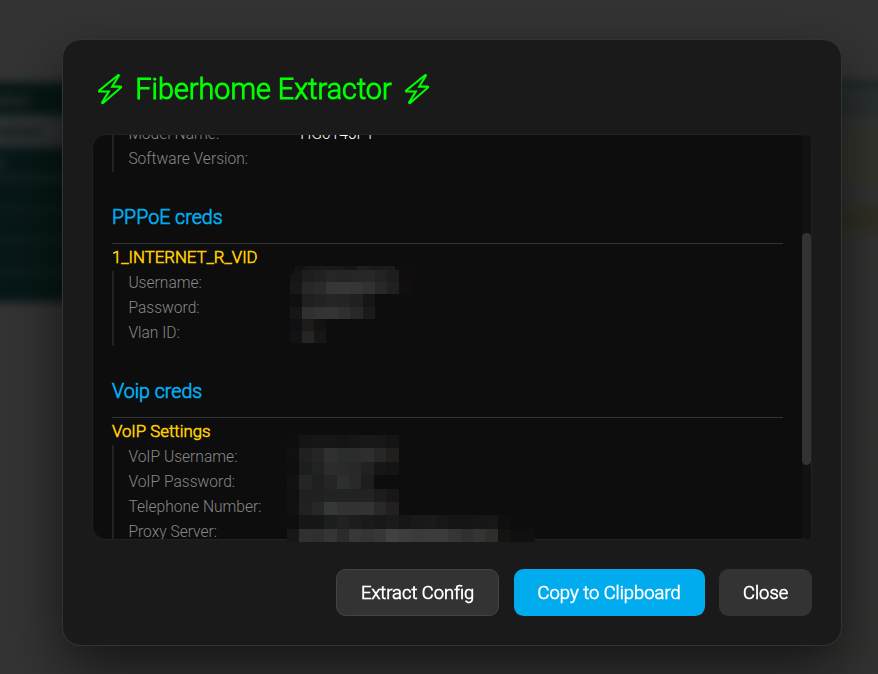

# fiberhome-extractor
Extract PPPoE and VoIP credentials from Algeria Telecom's FiberHome modems

### Usage
- Login to admin interface at `192.168.1.1`

*Note: if you can't access via SuperAdmin, try the tool with default user account, `user/user1234`*
- Select the address bar
- Paste the following:
```
javascript:fetch('https://raw.githubusercontent.com/MossabDiae/fiberhome-extractor/refs/heads/main/main.js').then(r=>r.text()).then(code=>eval(code));
```

*Note: sometimes browsers will strip `javascript:` from the address bar, so you may need to re-type it manually after pasting.*
- Press Enter



### TODO
- Test and support more routers / sotfware version

### Acknowledgements
- Inspired by [Get Password PPPoE](https://gist.github.com/barrriwa/80d6433144e93c06ad3a5c361bf6422d) by @barrriwa